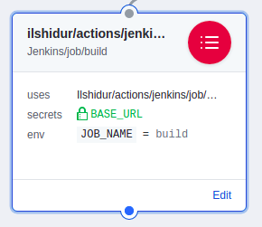

# Jenkins for GitHub Actions

Triggers a Jenkins build. Simple as that.



## Usage

```
action "Jenkins/job/build" {
  uses = "Ilshidur/actions/jenkins/job/build@master"
  secrets = ["BASE_URL", "JOB_NAME"]
}
```

**NOTICE :** for stability purposes, it is recommended to use the action with an explicit commit SHA-1 :

`uses = "Ilshidur/actions/jenkins/job/build@822bd84"` (=> link to the commits list : https://github.com/Ilshidur/actions/commits/master)

### Arguments

No arguments are required. If one is provided nonetheless, it will be ignored.

### Secrets

* **`BASE_URL`** (**required**): the Jenkins base URL.
* **`JOB_NAME`** (**required**): the Jenkins job's name.
* **`PARAMETERS`** (*optional*): JSON string containing the encoded parameters in **JSON format**
* **`TOKEN`** (*optional*): Authorization token
* That's all.
