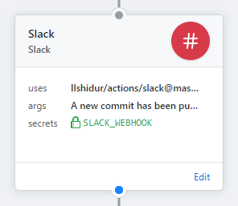

# Slack for GitHub Actions

Sends a Slack notification. Simple as that.



TODO: Slack image

## Usage

```
#TODO: Action description
```

### Arguments

The argument is the message to display in the Slack notification.

#### Examples

* `args = "Hello, beautiful ! I ran a GitHub Actions for you <3"`
* `args = "I showed you my commit. Please respond."`

### Secrets

* **`SLACK_WEBHOOK`**: the Slack webhook URL (**required**, see https://api.slack.com/incoming-webhooks)
* That's all.
